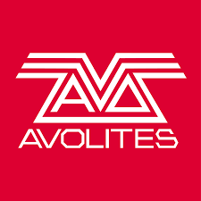

  <head>
    <meta charset="utf-8" />
    <meta name="description" content="Phil Rogers' portfolio site" />
    <meta name="keywords" content="Java,Spring,VXML,HTML,CSS,XML,JavaScript,VUI,Genesys,ContactCentre" />
    <meta name="author" content="Phil Rogers" />
    <meta name="viewport" content="width=device-width, initial-scale=1.0" />
    <link rel="shortcut icon" type="image/x-icon" href="favicon.ico" />
    <!-- Facebook Metadata /-->
    <meta property="og:title" content="Phil Rogers' portfolio site"/>
    <meta property="og:type" content="article" />
    <meta property="og:url" content="http://www.phil-rogers.uk"/>
    <meta property="og:image" content="http://www.phil-rogers.uk/static/images/fb_share.jpg"/>
    <meta property="og:description" content="London based Java &amp; web developer"/>

    <link rel="stylesheet" href="https://fonts.googleapis.com/css?family=Quicksand:300,400,500,700">
    <link rel="stylesheet" href="https://fonts.googleapis.com/css?family=Lato:100,300,400,700,900">
    <link rel="stylesheet" href="static/css/style.css" />
  </head>
  <body>
    

      

        

          <h2 class="f-large dark bold t-left">Phil Rogers</h2>
          <h3 class="f-medium dark bold t-left">Java Developer / Software Engineer</h3>
          

          

            

              Experienced Java Software Engineer with a demonstrated history in the 
              telecommunications industry. Skills include Java, Spring, SOAP and REST 
              Service development, Voice UI design and delivering bespoke integration
              in PCI environments.
            

            <!-- Social icons -->
            <ul class="social_icons">
              <li class="github">
                <a href="https://github.com/philrogersuk" target="_blank">
                  <i class="ion-social-octocat"></i>
                  
                </a>
              </li>
              <li class="twitter">
                <a href="https://twitter.com/colinzealuk" target="_blank">
                  <i class="ion-social-twitter"></i>
                  
                </a>
              </li>
              <li class="linkedin">
                <a href="http://uk.linkedin.com/in/philrogersuk" target="_blank">
                  <i class="ion-social-linkedin"></i>
                  
                </a>
              </li>
            </ul>
          

        

      

      

        

          

            
              <a class="chocolat-image" href="#" title="Aviva">
                

                  
Aviva

                

              </a>
          

          

            
              <a class="chocolat-image" href="#" title="avolites">
                

                  
Avolites

                

              </a>
          

          

            
              <a class="chocolat-image" href="#" title="ee">
                

                  
EE

                

              </a>
          

          

            
              <a class="chocolat-image" href="#" title="vodafone">
                

                  
Vodafone

                

              </a>
          

          

            
              <a class="chocolat-image" href="#" title="NHS">
                

                  
NHS 111 Service

                

              </a>
          

          

            
              <a class="chocolat-image" href="#" title="t-mobile">
                

                  
T-Mobile UK

                

              </a>
          

          

            
              <a class="chocolat-image" href="#" title="legalGeneral">
                

                  
Legal &amp; General

                

              </a>
          

          

            
              <a class="chocolat-image" href="#" title="nationalGrid">
                

                  
National Grid

                

              </a>
          

          

            
              <a class="chocolat-image" href="#" title="police">
                

                  
Police 101 Service

                

              </a>
          

          

            
              <a class="chocolat-image" href="#" title="tescoBank">
                

                  
Tesco Bank

                

              </a>
          

          

            
              <a class="chocolat-image" href="#" title="motonovo">
                

                  
Motonovo

                

              </a>
          

          

            
              <a class="chocolat-image" href="#" title="ena">
                

                  
ENA 106 Service

                

              </a>
          

        

        

          

            <h3 class="t-left f-big">About</h3>
            

            

             
Hi, I'm Phil Rogers, a Java Software Engineer with 11 years of industry 
              experience working for some of the biggest organisations in the UK. I have delivered
              numerous contact centre and automated interactive voice systems with deep integrations
              into all kinds of CRM systems.

              
I am a strong and positive communicator and collaborator as well as a quick 
              learner, driven to pushing teams forward to improve development, deployment 
              and operational tools wherever possible.

              

              <a href="static/docs/phil-rogers-cv.pdf">
                
Full CV Download

              </a>
              

            

          

        

      

    

  </body>